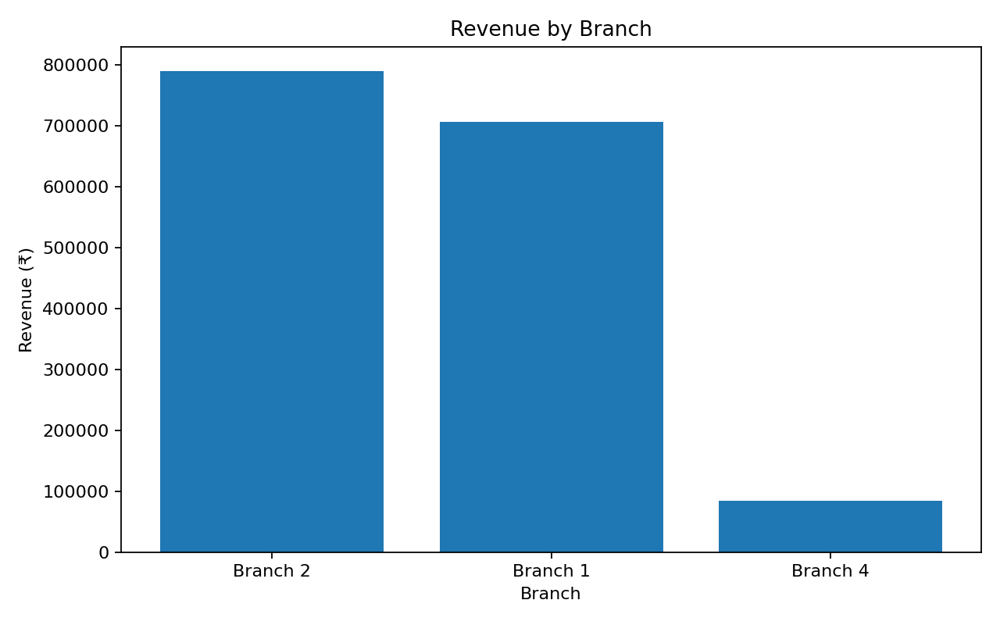
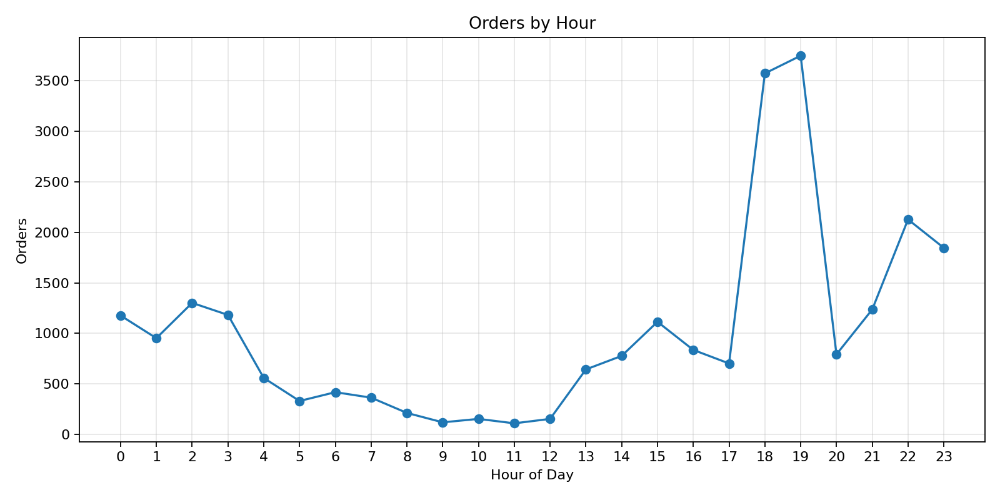
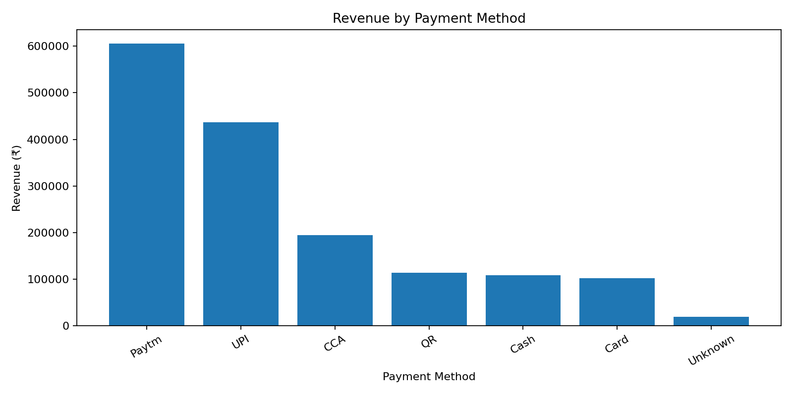
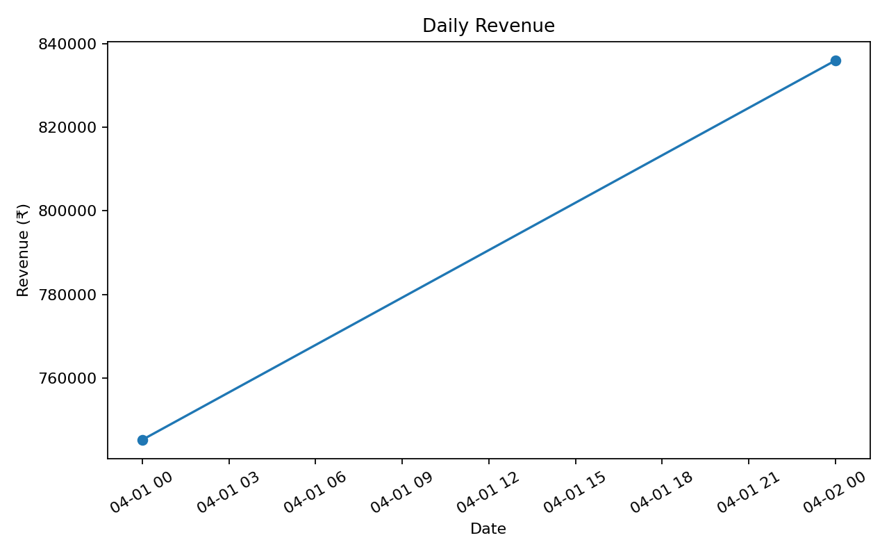
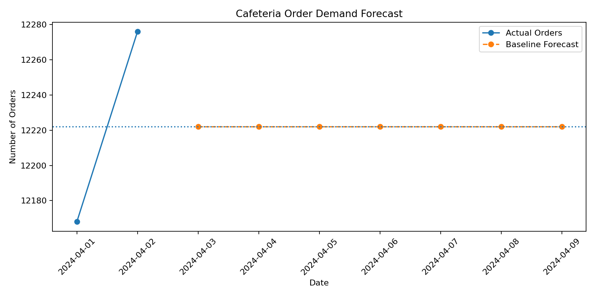

# ☕ Cafeteria Analytics

> **Turning cafeteria transaction data into meaningful business insights.**


---

## 📌 Project Overview

**Cafeteria Analytics** is a data analytics and demand estimation project developed to analyze cafeteria transaction data and extract useful business insights.

The project focuses on understanding:

- Sales and revenue performance
- Branch-wise order activity
- Peak ordering hours
- Payment method usage
- Daily sales patterns
- Data-quality issues
- Baseline demand estimation

The project was developed as part of the **Kanishka Software Pvt. Ltd. Internship Evaluation Challenge**.

---

## 📊 Project Snapshot

| Category | Details |
|---|---|
| Project Type | Data Analytics & Forecasting |
| Domain | Cafeteria / Food Service |
| Transactions | 24,444 |
| Customers | 6,661 |
| Branches | 3 |
| Revenue | ₹15,81,186.20 |
| Average Order Value | ₹64.69 |
| Analysis Period | 1–2 April 2024 |
| Primary Language | Python |
| Database | MySQL |

---

# 🎯 Problem Statement

A cafeteria generates a large number of transactions, but raw transaction data alone does not provide clear business insights.

This project analyzes the available transaction data to answer questions such as:

- Which branch generates the highest revenue?
- What are the busiest ordering hours?
- Which payment methods are frequently used?
- How does daily revenue change?
- Are there unusual transactions?
- What is the baseline level of daily demand?

---

# 🔄 Project Workflow

```text
Transaction Data
       ↓
Data Preparation
       ↓
Exploratory Data Analysis
       ↓
KPI Calculation
       ↓
Branch Analysis
       ↓
Hourly Analysis
       ↓
Payment Analysis
       ↓
Data Quality Checks
       ↓
Demand Estimation
       ↓
Visual Insights
```

---

# 💰 Overall Performance

| KPI | Value |
|---|---:|
| Total Orders | **24,444** |
| Total Revenue | **₹15,81,186.20** |
| Average Order Value | **₹64.69** |
| Unique Customers | **6,661** |
| Branches | **3** |
| Zero-Value Orders | **435** |

---

# 🏢 Branch Analysis

The transaction data was grouped by branch to compare order volume and revenue.

| Branch | Orders | Revenue | AOV |
|---|---:|---:|---:|
| Branch 2 | 12,483 | ₹7,90,096.20 | ₹63.29 |
| Branch 1 | 10,326 | ₹7,06,472.00 | ₹68.42 |
| Branch 4 | 1,635 | ₹84,618.00 | ₹51.75 |

### Revenue by Branch



### Key Observation

Branch 2 recorded the highest order volume and the highest recorded revenue.

Branches 1 and 2 together contributed approximately **94.65% of total recorded revenue**.

---

# ⏰ Hourly Order Analysis

Hourly transaction data was analyzed to identify periods with higher order activity.

### Top Recorded Hours

| Time | Orders |
|---|---:|
| **19:00** | **3,746** |
| **18:00** | **3,571** |
| **22:00** | **2,127** |
| **23:00** | **1,846** |
| **02:00** | **1,302** |

### Orders by Hour



### Observation

The highest recorded order volume occurred at **19:00**, followed by **18:00**.

The available data shows stronger ordering activity during the evening hours.

---

# 💳 Payment Method Analysis

Payment methods were analyzed based on order volume, revenue and average order value.

| Payment Method | Orders | Revenue | AOV |
|---|---:|---:|---:|
| Paytm | 10,109 | ₹6,05,197.70 | ₹59.87 |
| UPI | 5,591 | ₹4,36,978.00 | ₹78.16 |
| CCA | 2,823 | ₹1,94,752.00 | ₹68.99 |
| QR | 2,353 | ₹1,14,031.00 | ₹48.46 |
| Cash | 2,062 | ₹1,08,379.00 | ₹52.56 |
| Card | 1,210 | ₹1,02,551.00 | ₹84.75 |
| Unknown | 296 | ₹19,297.50 | ₹65.19 |

### Revenue by Payment Method



### Observation

Paytm generated the highest recorded revenue share.

Card transactions recorded the highest average order value among the listed payment methods.

---

# 📅 Daily Sales Analysis

The available dataset contains two days of transaction data.

| Date | Orders | Revenue | AOV |
|---|---:|---:|---:|
| 01-Apr-2024 | 12,168 | ₹7,45,170.20 | ₹61.24 |
| 02-Apr-2024 | 12,276 | ₹8,36,016.00 | ₹68.10 |

### Daily Revenue



The dataset is limited to two days, so these values should not be interpreted as a long-term sales trend.

---

# 🧹 Data Quality Analysis

Data-quality checks were performed before drawing conclusions from the transaction data.

### Checks Performed

- Zero-value transactions
- Negative-value transactions
- Repeated order numbers
- Payment method values
- Date and time values
- Branch values
- Customer identifiers

---

## ⚠️ Zero-Value Transactions

A total of **435 transactions** had:

`grand_total = ₹0`

These records were not automatically removed.

Further investigation showed that the records contained other transaction information, including positive subtotal/reward values. Therefore, they were retained and flagged for further analysis.

---

## 🔁 Repeated Order Numbers

Repeated order-number values were identified during the data-quality analysis.

They were not automatically treated as duplicate transactions because records with the same order number could differ in:

- Customer
- Date
- Branch
- Order value
- Payment method

Therefore, repeated values were flagged rather than blindly deleted.

---

# 🔮 Demand Estimation

A simple baseline approach was used to estimate daily demand.

### Baseline Demand

**12,222 orders/day**

The baseline was calculated using the average daily order volume available in the dataset.

### Forecast Visualization



> **Note:** This is a baseline estimate and not a production-level machine-learning forecasting model. Only two days of historical data are available.

---

# 💡 Key Insights

### 🏢 Branch Performance
Branch 2 recorded the highest number of orders and revenue.

### ⏰ Peak Ordering
19:00 was the highest recorded ordering hour.

### 💳 Payment Behaviour
Paytm accounted for the largest recorded revenue share.

### 📊 Order Value
Card transactions had the highest recorded AOV among the listed payment methods.

### ⚠️ Data Quality
435 zero-value transactions were identified and retained for investigation.

### 🔮 Forecasting
The available data supports only a simple baseline demand estimate.

---

# 🛠️ Technology Stack

| Technology | Usage |
|---|---|
| **Python** | Data analysis and processing |
| **Pandas** | Data manipulation |
| **NumPy** | Numerical operations |
| **Matplotlib** | Data visualization |
| **MySQL** | Database and SQL analysis |
| **Git** | Version control |
| **GitHub** | Repository hosting |

---

# 📂 Project Structure

```text
Cafeteria-Order/
│
├── README.md
├── eda_analysis.py
├── forecast.py
├── requirements.txt
│
├── cafeteria_forecast_preview.png
├── daily_revenue.png
├── orders_by_hour.png
├── payment_revenue.png
└── revenue_by_branch.png
```

---

# 🐍 Python Implementation

## `eda_analysis.py`

This script performs the main exploratory analysis of the cafeteria transaction data.

### Main Operations

```text
Load Data
   ↓
Data Preparation
   ↓
KPI Calculation
   ↓
Branch Analysis
   ↓
Hourly Analysis
   ↓
Payment Analysis
   ↓
Daily Analysis
   ↓
Data Quality Checks
   ↓
Charts
```

The script generates analysis outputs and visualizations for:

- Branch revenue
- Hourly orders
- Payment revenue
- Daily revenue
- Data-quality checks

---

## `forecast.py`

This script calculates the baseline daily demand from historical order data.

### Process

```text
Historical Orders
       ↓
Daily Order Count
       ↓
Average Daily Demand
       ↓
Future Dates
       ↓
Baseline Forecast
       ↓
Forecast Visualization
```

The forecast output is stored in:

```text
forecast_results.csv
```

---

## `requirements.txt`

The project dependencies are maintained separately.

```text
pandas
numpy
matplotlib
scikit-learn
```

---

# ▶️ How to Run

### Step 1 — Clone the repository

```bash
git clone https://github.com/kartikipatil010/Cafeteria-Order.git
```

### Step 2 — Open the project

```bash
cd Cafeteria-Order
```

### Step 3 — Install dependencies

```bash
pip install -r requirements.txt
```

### Step 4 — Run analysis

```bash
python eda_analysis.py
```

### Step 5 — Run demand estimation

```bash
python forecast.py
```

---

# ⚠️ Limitations

- The available dataset covers only **two days**.
- Long-term sales trends cannot be established.
- Seasonal patterns cannot be reliably measured.
- Forecast accuracy cannot be meaningfully evaluated with only two days of history.
- Product-level demand analysis is not included.
- The current forecast is a baseline estimate.

---

# 🚀 Future Scope

With a larger historical dataset, the project can be extended with:

- Weekly and monthly sales analysis
- Seasonal demand analysis
- Product-level forecasting
- Customer segmentation
- Inventory demand prediction
- Staff scheduling analysis
- Machine-learning forecasting
- Power BI dashboard
- Interactive Plotly dashboard
- Automated business reporting

---

# 🎓 Skills Demonstrated

**Programming**
- Python
- SQL

**Data Analytics**
- Data Cleaning
- Exploratory Data Analysis
- KPI Analysis
- Business Analytics
- Data Quality Analysis

**Visualization**
- Matplotlib
- Data Visualization

**Database**
- MySQL

**Development**
- Git
- GitHub

---

# 👩‍💻 Author

## Kartiki Patil

Computer Engineering Student

GitHub: [@kartikipatil010](https://github.com/kartikipatil010)

---

# 📌 Internship Evaluation

This project was developed as part of the:

**Kanishka Software Pvt. Ltd. Internship Evaluation Challenge**

The project demonstrates the complete workflow:

```text
Data
 ↓
Analysis
 ↓
Visualization
 ↓
Data Quality
 ↓
Demand Estimation
 ↓
Business Insights
```

---

> **Turning transaction data into actionable insights.**
